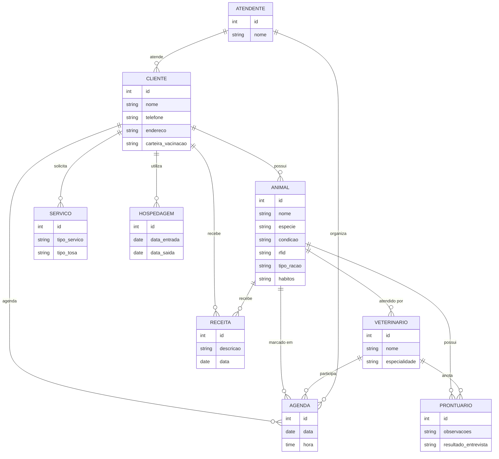
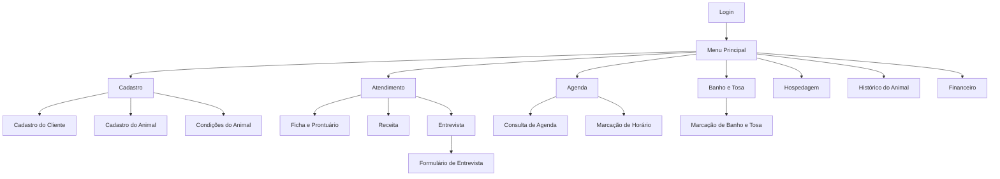
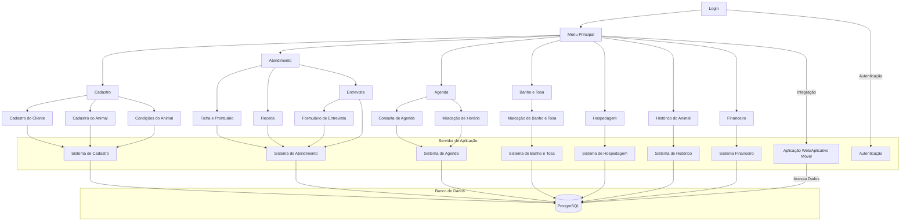

# otavio_maniezzo
Repositório da disciplina de engenharia de software.

- [otavio\_maniezzo](#otavio_maniezzo)
- [1. Introdução](#1-introdução)
- [2. Descrição do sistema.](#2-descrição-do-sistema)
- [3. Visão geral do sistema.](#3-visão-geral-do-sistema)
- [4. Diagrama ER](#4-diagrama-er)
  - [4.1. Descrição das entidades:](#41-descrição-das-entidades)
  - [4.2. Descrição dos relacionamentos:](#42-descrição-dos-relacionamentos)
- [5. Diagrama de classe.](#5-diagrama-de-classe)
  - [5.1. Descrição das classes:](#51-descrição-das-classes)
  - [5.2. Descrição dos relacionamentos:](#52-descrição-dos-relacionamentos)
- [6. Casos de uso.](#6-casos-de-uso)
  - [6.1 Casos de uso](#61-casos-de-uso)
  - [6.2 Histórias de usuario.](#62-histórias-de-usuario)
- [Histórias de Usuário](#histórias-de-usuário)
  - [Cadastro de Cliente e Animal](#cadastro-de-cliente-e-animal)
  - [Informar Condições do Animal](#informar-condições-do-animal)
  - [Informar Tipo de Ração](#informar-tipo-de-ração)
  - [Informar Hábitos do Animal](#informar-hábitos-do-animal)
  - [Atendimento por Vários Veterinários](#atendimento-por-vários-veterinários)
  - [Atendimento com Agenda do Dia](#atendimento-com-agenda-do-dia)
  - [Ficha e Prontuário](#ficha-e-prontuário)
  - [Marcar Atendimento Futuro](#marcar-atendimento-futuro)
  - [Gerar Receita](#gerar-receita)
  - [Atendimento Inicial pelo Atendente](#atendimento-inicial-pelo-atendente)
  - [Verificar Agenda com Veterinário](#verificar-agenda-com-veterinário)
  - [Fila de Espera](#fila-de-espera)
  - [Levar Cliente até o Veterinário](#levar-cliente-até-o-veterinário)
  - [Entrevista Inicial com o Dono do Animal](#entrevista-inicial-com-o-dono-do-animal)
  - [Formulário de Entrevista](#formulário-de-entrevista)
  - [Exame e Prontuário](#exame-e-prontuário)
  - [Receita para Tratamento](#receita-para-tratamento)
  - [Marcar Animal com RFID](#marcar-animal-com-rfid)
  - [Informar Carteira de Vacinação](#informar-carteira-de-vacinação)
  - [Serviço de Banho e Tosa](#serviço-de-banho-e-tosa)
  - [Informar Tipo de Tosa](#informar-tipo-de-tosa)
  - [Serviço de Hospedagem](#serviço-de-hospedagem)
- [7. Diagrama de componentes.](#7-diagrama-de-componentes)
- [8. Diagrama de implantação.](#8-diagrama-de-implantação)
- [9. Protótipo de telas.](#9-protótipo-de-telas)
  - [9.1. Telas Script Case](#91-telas-script-case)
- [10. Diagrama de navegaçaõ de telas.](#10-diagrama-de-navegaçaõ-de-telas)
- [11. Pilha tecnológica.](#11-pilha-tecnológica)
- [12. Requisitos de sistema.](#12-requisitos-de-sistema)
  - [12.1 Requisitos do lado do Cliente.](#121-requisitos-do-lado-do-cliente)
  - [12.2 Requisitos do lado de Servidor](#122-requisitos-do-lado-de-servidor)
- [13. Considerações de segurança.](#13-considerações-de-segurança)
  - [13.1. Lado Cliente](#131-lado-cliente)
  - [13.2. Lado Servidor](#132-lado-servidor)
- [14. Manutenção, instalação e Novas Funcionalidade](#14-manutenção-instalação-e-novas-funcionalidade)
  - [14.1. Instalado no servidor](#141-instalado-no-servidor)
  - [14.2. Manutenção](#142-manutenção)
  - [14.3. Novas funcionalidades](#143-novas-funcionalidades)
- [15. Treinamento](#15-treinamento)
  - [15.1. Usuario](#151-usuario)
  - [15.2. Admin](#152-admin)
- [16. Script SQL](#16-script-sql)
  - [16.1. Comandos create table;](#161-comandos-create-table)
  - [16.2. Comandos insert gerando dados ficticios;](#162-comandos-insert-gerando-dados-ficticios)


# 1. Introdução

O projeto a seguir apresenta um sistema desenvolvido para uma petshop. A empresa é considerada micro e inciou as atividades recentemente. Ao possuir serviços exclusivos, os sistemas presentes no mercado não se enquadra, desta forma, os proprietários decidiram desenvolver uma solução própria. Esta solução é detalhada a seguir.

# 2. Descrição do sistema.

Descrição do cenário onde o sistema deverá funcionar.

1. Uma clínica veterinária atende apenas os animais: gatos e cachorros
   
2. Os clientes devem fazer um cadastro de si e dos animais.
   
3. Os clientes devem informar as condições nas quais os animais chegam.
   
4. Os clientes devem informar o tipo de ração que o animal come.
   
5. O cliente deve informar hábitos do animal
   
6. Para cada animal é possível que mais de um veterinário o atenda.
   
7. Os animais podem chegar e serem atendidos de acordo com uma agenda do dia.
   
8. Cada animal atendido receberá uma ficha e um prontuário
   
9.  Outros dono podem querer marcar horários de atendimento futuro
    
10. O atendimento gera uma receita para o animal.
    
11. Quando um cliente chega na clínica veterinária ele é atendido por um atendente.
    
12. O atendente deve verificar se existe agenda disponível com um veterinário.
    
13. O atendente deve colocar o cliente e seu animal na fila de espera, se for o caso.
    
14. O atendente deve levar o cliente e o animal até o veterinário. 
    
15. O veterinário deve realizar uma entrevista com o dono do animal.
    
16. O resultado da entrevista deve ir para um formulário.
    
17. O veterinário deverá examinar o animal e anotar em prontuário(ficha) suas observações.
    
18. Dependendo da situação do animal este receberá uma receita.
    
19. Marcar os animais com RFID.
    
20. O clientes devem informar dados da carteira de vacinação 
    
21. A clinica busca e entrega animais para banho e tosa
    
22. O tipo de tosa deve ser previamente informado 
    
23. Oferece hospedagem para os animais 
    

   


# 3. Visão geral do sistema.

Cliente:

Cadastra seus animais com detalhes (nome, espécie, condições).

Agenda consultas e solicita serviços (banho, tosa, hospedagem).

Acessa prontuários e receitas emitidas pelos veterinários.

Veterinário:

Consulta o histórico dos animais.

Registra atendimentos e preenche prontuários.

Prescreve receitas e gerencia sua agenda.

Atendente:

Organiza a agenda de consultas.

Gerencia a fila de espera e acompanha serviços.

Relações:

Cliente-Animal: Clientes gerenciam informações e agendamentos dos animais.

Animal-Veterinário: Animais são atendidos por veterinários, que registram as consultas e receitas.

Atendente-Agenda: Atendentes organizam a agenda de consultas e serviços.

Benefícios:

Praticidade: Gestão centralizada para clientes, veterinários e atendentes.

Transparência: Acesso fácil ao histórico de saúde dos animais.

Eficiência: Melhor organização das tarefas diárias da clínica.

Segurança: Proteção de dados sensíveis dos clientes e animais.

O sistema melhora a organização e a experiência dos usuários, tornando o processo de atendimento mais ágil e eficaz.

# 4. Diagrama ER


## 4.1. Descrição das entidades:

CLIENTE: Dados dos clientes da clínica (nome, telefone, endereço, carteira de vacinação).

ANIMAL: Informações dos animais (nome, espécie, condição, RFID, ração, hábitos).

VETERINARIO: Dados dos veterinários (nome, especialidade).

ATENDENTE: Informações dos atendentes (nome).

AGENDA: Horários de atendimento (data, hora).

RECEITA: Prescrições para os animais (descrição, data).

PRONTUARIO: Histórico médico dos animais (observações, resultado da entrevista).

SERVICO: Serviços oferecidos (tipo, tipo de tosa).

HOSPEDAGEM: Registro de hospedagem (data de entrada e saída).

## 4.2. Descrição dos relacionamentos:

CLIENTE → ANIMAL: Um cliente pode ter vários animais.

CLIENTE → AGENDA: Um cliente pode marcar vários horários.

CLIENTE → RECEITA: Um cliente pode receber várias receitas.

CLIENTE → HOSPEDAGEM: Um cliente pode utilizar o serviço de hospedagem.

CLIENTE → SERVICO: Um cliente pode solicitar diversos serviços.

ANIMAL → VETERINARIO: Um animal pode ser atendido por vários veterinários.

ANIMAL → PRONTUARIO: Um animal tem um prontuário.

ANIMAL → RECEITA: Um animal pode receber várias receitas.

ANIMAL → AGENDA: Um animal pode ter vários horários marcados.

VETERINARIO → AGENDA: Um veterinário pode estar em várias agendas.

VETERINARIO → PRONTUARIO: Um veterinário anota observações no prontuário.

ATENDENTE → CLIENTE: Um atendente atende vários clientes.

ATENDENTE → AGENDA: Um atendente organiza a agenda.


# 5. Diagrama de classe.


## 5.1. Descrição das classes:

Cliente: Dados do cliente e operações para gerenciar os animais e suas condições.

Animal: Informações dos animais e sua relação com os veterinários.

Veterinario: Informações dos veterinários e ações relacionadas a consultas e prescrições.

Atendente: Gerencia a agenda e organiza a fila de espera.

Ficha: Registra observações dos atendimentos.

Prontuario: Contém informações detalhadas do histórico de saúde do animal.

Receita: Prescrições fornecidas pelo veterinário.

Agenda: Registra os horários das consultas entre veterinários, clientes e animais.

Servico: Representa serviços adicionais solicitados (banho, tosa).

Hospedagem: Registra as reservas de hospedagem dos animais.

## 5.2. Descrição dos relacionamentos:

Cliente → Animal: Um cliente pode ter vários animais.

Cliente → Agenda: Um cliente pode agendar várias consultas.

Cliente → Receita: Um cliente pode receber várias receitas.

Cliente → Hospedagem: Um cliente pode utilizar o serviço de hospedagem.

Cliente → Servico: Um cliente pode solicitar serviços como banho ou tosa.

Animal → Veterinario: Um animal pode ser atendido por vários veterinários.

Animal → Ficha: Um animal possui uma ficha com observações.

Animal → Prontuario: Um animal tem um prontuário com o histórico de saúde.

Animal → Receita: Um animal pode receber várias receitas.

Animal → Agenda: Um animal pode estar marcado em várias agendas.

Veterinario → Prontuario: Um veterinário preenche o prontuário do animal.

Veterinario → Ficha: Um veterinário anota observações na ficha do animal.

Veterinario → Agenda: Um veterinário participa de várias consultas.

Atendente → Cliente: Um atendente organiza os atendimentos para vários clientes.

Atendente → Agenda: Um atendente gerencia as agendas de atendimento.

# 6. Casos de uso.

## 6.1 Casos de uso


## 6.2 Histórias de usuario.

# Histórias de Usuário

## Cadastro de Cliente e Animal
**Como** cliente da clínica veterinária,  
**Quero** cadastrar meus dados pessoais e os dados dos meus animais,  
**Para** que eu possa utilizar os serviços da clínica.

## Informar Condições do Animal
**Como** cliente da clínica veterinária,  
**Quero** informar as condições em que o meu animal chegou à clínica,  
**Para** que o veterinário possa entender o estado atual do animal.

## Informar Tipo de Ração
**Como** cliente da clínica veterinária,  
**Quero** informar o tipo de ração que o meu animal consome,  
**Para** que essa informação esteja registrada no prontuário do animal.

## Informar Hábitos do Animal
**Como** cliente da clínica veterinária,  
**Quero** informar os hábitos do meu animal,  
**Para** que o veterinário tenha um histórico comportamental do animal.

## Atendimento por Vários Veterinários
**Como** administrador da clínica,  
**Quero** que mais de um veterinário possa atender o mesmo animal,  
**Para** garantir a flexibilidade e a disponibilidade no atendimento.

## Atendimento com Agenda do Dia
**Como** cliente da clínica veterinária,  
**Quero** que o meu animal seja atendido conforme a agenda disponível do dia,  
**Para** que o atendimento seja organizado e eficiente.

## Ficha e Prontuário
**Como** veterinário,  
**Quero** registrar as informações do atendimento de cada animal em uma ficha e prontuário,  
**Para** manter um histórico médico completo do animal.

## Marcar Atendimento Futuro
**Como** cliente da clínica veterinária,  
**Quero** poder marcar horários de atendimento futuro para o meu animal,  
**Para** garantir que o atendimento ocorra em um momento conveniente.

## Gerar Receita
**Como** veterinário,  
**Quero** gerar uma receita após o atendimento do animal,  
**Para** prescrever medicamentos ou tratamentos adequados.

## Atendimento Inicial pelo Atendente
**Como** atendente da clínica veterinária,  
**Quero** receber o cliente e seu animal ao chegarem na clínica,  
**Para** garantir que o processo de atendimento seja iniciado corretamente.

## Verificar Agenda com Veterinário
**Como** atendente da clínica veterinária,  
**Quero** verificar a agenda disponível dos veterinários,  
**Para** saber se há disponibilidade para o atendimento imediato ou futuro.

## Fila de Espera
**Como** atendente da clínica veterinária,  
**Quero** colocar o cliente e seu animal em uma fila de espera, caso necessário,  
**Para** organizar o fluxo de atendimentos.

## Levar Cliente até o Veterinário
**Como** atendente da clínica veterinária,  
**Quero** levar o cliente e seu animal até o veterinário,  
**Para** garantir que o atendimento ocorra sem problemas.

## Entrevista Inicial com o Dono do Animal
**Como** veterinário,  
**Quero** realizar uma entrevista com o dono do animal,  
**Para** entender o histórico e as condições do animal antes de iniciar o exame.

## Formulário de Entrevista
**Como** veterinário,  
**Quero** registrar os resultados da entrevista em um formulário,  
**Para** que essas informações fiquem documentadas no prontuário do animal.

## Exame e Prontuário
**Como** veterinário,  
**Quero** examinar o animal e anotar minhas observações no prontuário,  
**Para** manter um registro médico preciso.

## Receita para Tratamento
**Como** veterinário,  
**Quero** emitir uma receita para o tratamento do animal, se necessário,  
**Para** que o animal receba o cuidado adequado.

## Marcar Animal com RFID
**Como** administrador da clínica veterinária,  
**Quero** marcar os animais com RFID,  
**Para** facilitar a identificação e o acompanhamento do animal.

## Informar Carteira de Vacinação
**Como** cliente da clínica veterinária,  
**Quero** informar os dados da carteira de vacinação do meu animal,  
**Para** que o veterinário tenha acesso ao histórico vacinal.

## Serviço de Banho e Tosa
**Como** cliente da clínica veterinária,  
**Quero** solicitar o serviço de busca e entrega do meu animal para banho e tosa,  
**Para** que meu animal receba esses cuidados sem que eu precise levá-lo à clínica.

## Informar Tipo de Tosa
**Como** cliente da clínica veterinária,  
**Quero** informar o tipo de tosa desejada para meu animal,  
**Para** que o serviço de tosa atenda às minhas preferências.

## Serviço de Hospedagem
**Como** cliente da clínica veterinária,  
**Quero** solicitar o serviço de hospedagem para o meu animal,  
**Para** que ele seja cuidado enquanto eu estiver ausente.


# 7. Diagrama de componentes.


# 8. Diagrama de implantação.


# 9. Protótipo de telas.

## 9.1. Telas Script Case

Tela de Login:


Tela Dashboard:


Tela de relatório de clientes:


Tela de cadastro de clientes:


Tela de relatório de animais:


Tela de cadastro de animais:


Tela de relatorio da agenda:


Tela de cadastro da agenda:


Tela de relatório de atendente:


Tela do grafico de cliente:


Tela de alteração de senha:


Tela de configurações de segurança:


# 10. Diagrama de navegaçaõ de telas.


# 11. Pilha tecnológica.



# 12. Requisitos de sistema.

## 12.1 Requisitos do lado do Cliente.
1. Tipo de Sistema Operacional:
   
Windows, Linux, Android, iOS.

Compatibilidade com versões recentes dos sistemas operacionais.

2. Tipo de Navegador:

Navegadores compatíveis: Chrome, Firefox, Safari, Edge (versões atualizadas).

3. Acesso à Internet:

Conexão estável à internet com banda mínima necessária para operação (recomendado: 2 Mbps ou superior).

4. Recursos de Hardware (PC ou Mobile):

PC:
Processador: Intel Core i3 ou superior;
Memória RAM: 4 GB (mínimo).
Mobile:
Processador: ARM Cortex-A53 ou superior;
Memória RAM: 2 GB (mínimo).

5. Resolução de Tela:
Mínima: 1366x768 (PC).
Suporte para telas de alta resolução em dispositivos móveis (mínimo: 720p).

6. Permissões e Configurações de Segurança:

Permissão para acessar internet e armazenamento local (cookies, cache).
Permissões para o uso de câmera e microfone, se aplicável (por exemplo, para teleconsultas).

7. Forma de Autenticação:

Login com autenticação de dois fatores (2FA) recomendado.

## 12.2 Requisitos do lado de Servidor

1. Tipo de Sistema Operacional:

Windows ou Linux (Ubuntu, CentOS, Debian), que suportem servidores web como Apache, Nginx ou IIS.

2. Tipo de Processador:

Processador de servidor: Intel Xeon ou AMD EPYC, com no mínimo 4 núcleos.

3. Memória RAM:

Mínimo de 8 GB, recomendado 16 GB ou mais, dependendo da quantidade de usuários simultâneos.

4. Armazenamento:

Armazenamento SSD de pelo menos 100 GB para o servidor de aplicação e banco de dados.
Capacidade adicional para backups automáticos e logs do sistema.

5. Rede:

Largura de banda adequada (mínimo 1 Gbps).
Endereço IP estático ou nome de domínio configurado.

6. Segurança:

Certificados SSL para criptografia de dados em trânsito.
Firewall configurado para proteger contra acessos não autorizados.
Monitoramento de tráfego e detecção de intrusões.

7. Escalabilidade:

Suporte para escalabilidade vertical (upgrades de hardware) e horizontal (adicionar mais servidores conforme necessário).
Suporte a múltiplas conexões simultâneas com usuários.

8. Serviços e Backup:

Sistema de backup automatizado (diário/semanal) para garantir a integridade dos dados.
Soluções de armazenamento de backup em mídia externa ou em nuvem.

# 13. Considerações de segurança.

## 13.1. Lado Cliente

1. HTTPS:

Criptografia para proteger os dados transmitidos entre cliente e servidor.

2. Validação de Navegador:

Verificação de navegadores compatíveis com as últimas atualizações de segurança.

3. Validações de Páginas e Conteúdo:

Uso de técnicas como validação de entrada de dados para evitar ataques de XSS e injeção de código.

4. Regra de Senha:

Exigir uma senha com quantidade mínima de caracteres, inclusão de caracteres especiais e regras específicas de segurança de senha para aumentar a complexidade e a proteção.

5. CAPTCHA:

Utilização de CAPTCHA para prevenir bots e ataques automatizados em áreas sensíveis, como login e formulários de contato.

6. Autenticação de Dois Fatores (2FA):

Implementação de autenticação de dois fatores (2FA), exigindo uma segunda forma de validação, como código enviado por SMS ou aplicativo de autenticação.

7. Recuperação de Senha via E-mail:

Oferecer a opção de recuperação de senha, onde o usuário recebe um código de recuperação enviado ao e-mail cadastrado.

## 13.2. Lado Servidor 

1. Configuração de Pastas:

Manter pastas de arquivos com permissões adequadas, restringindo o acesso a áreas sensíveis.

2. Verificação de Dados de Entrada:

Sanitizar e validar todos os dados recebidos dos clientes.

3. Gerenciamento de Atualizações:

Garantir que o servidor esteja sempre atualizado com os últimos patches de segurança.

4. Hospedagem Segura:

Implementação de proteção contra ataques e infraestruturas seguras de hospedagem.

5. Uso de Certificados no Servidor:

Utilização de certificados SSL/TLS para criptografar dados em trânsito e garantir a autenticidade do servidor.

6. Sistema de Monitoramento e Logs:

Monitoramento constante e logs detalhados para rastrear atividades suspeitas ou tentativas de ataque.

7. Sistema Automatizado de Backup:

Implementar uma política de backup com Linux, seguindo o cronograma:

1 backup completo a cada 15 dias.
Backup incremental no final de cada dia.
Os backups devem ser criptografados e armazenados de forma segura.

8. Acesso Restrito aos Administradores:

O administrador do sistema não terá acesso aos dados pessoais dos usuários para proteger a privacidade e minimizar riscos.

# 14. Manutenção, instalação e Novas Funcionalidade

## 14.1. Instalado no servidor 

1. Instalação:

Requisitos: O sistema requer um servidor compatível com Linux ou Windows, suporte a banco de dados (ex: MySQL) e um navegador moderno para os clientes.

Etapas:

Servidor: Configuração do ambiente (SO, banco de dados, servidor web) e instalação do sistema.

Cliente: Acesso via navegador web, sem necessidade de instalação no dispositivo do usuário.

Configuração Inicial: Registro de dados da clínica, veterinários, atendentes e regras de agendamento.

## 14.2. Manutenção

Backups: Implementação de uma política de backups regulares, com backups completos mensais e incrementais diários, para proteger dados críticos.

Atualizações:

Sistema: Correções de bugs e patches de segurança lançados regularmente.

Banco de Dados: Monitoramento do desempenho e otimização conforme o volume de dados aumenta.

Monitoramento: Ferramentas de monitoramento para acompanhar o desempenho e detectar problemas (tempo de resposta, uso de recursos, etc.).

## 14.3. Novas funcionalidades

1. formalização do pedido
2. Cliente não da palpite em beleza de tela
3. decidir sobre 3 criterios:
a) equipe tem tempo?
b) é economicamente viável?
c) é tecnologicamente viável?

Novas Funcionalidades:

Solicitações: Novas funcionalidades podem ser implementadas conforme as necessidades da clínica evoluem. Ex: integração com pagamento online, relatórios avançados.

Desenvolvimento Ágil: Utilização de um ciclo de desenvolvimento ágil, permitindo a adição de funcionalidades por meio de sprints curtos e atualizações frequentes.

Feedback: O feedback dos usuários (clientes, veterinários, atendentes) é coletado para priorizar melhorias.


# 15. Treinamento

## 15.1. Usuario

A maneira mais eficiente de realizar o treinamento seria pela disponibilização de videos instrutivos pela Web.

Os videos precisam conter:

1. Acesso ao Sistema e Funções Básicas:

Introdução à interface de atendentes e veterinários.

Explicação sobre como fazer login, navegar no sistema, e acessar funcionalidades.

2. Gerenciamento de Consultas e Fila de Espera (Atendentes):

Como verificar e ajustar a agenda de consultas.

Adicionar e remover clientes da fila de espera.

Acompanhamento do fluxo de atendimento do cliente.

3. Registro de Informações e Prontuário (Veterinários):

Como preencher e atualizar o prontuário do animal durante e após a consulta.

Adição de observações no prontuário e ficha médica.

4. Prescrição de Receitas:

Como prescrever e registrar receitas para os animais atendidos.

Gerenciamento e emissão de receitas para os clientes.

5. Dúvidas e Resolução de Problemas:

Treinamento em como resolver problemas comuns no uso do sistema.

Sessão de perguntas e respostas com foco nas operações do dia a dia.

## 15.2. Admin

1. Introdução ao Sistema e Interface de Administração:

Apresentação das funcionalidades administrativas.

Navegação na interface de gerenciamento do sistema, incluindo visualização de logs e gestão de usuários.

2. Gestão de Usuários e Permissões:

Como criar, editar e remover contas de usuários (clientes, atendentes, veterinários).

Configuração de níveis de acesso e permissões de acordo com o perfil de cada usuário.

3. Gerenciamento de Agendas e Atendimentos:

Como visualizar, alterar e ajustar a agenda de atendimentos.

Configuração de horários e atribuição de veterinários aos clientes e animais.

4. Backup e Recuperação de Dados:

Explicação da política de backup:

Backup completo mensal e a cada 15 dias.

Backup incremental diário.

Passo a passo para restaurar dados em caso de necessidade.

5. Segurança e Privacidade de Dados:

Configurações de segurança no sistema, como certificado SSL e firewall.

Explicação da política de segurança, incluindo a restrição de acesso a dados sensíveis (o administrador não tem acesso aos dados do cliente).

6. Monitoramento do Sistema e Logs:

Como acessar e monitorar os logs do sistema para auditoria e resolução de problemas.

Configuração de alertas para atividades suspeitas ou problemas no sistema.

7. Atualização do Sistema:

Instrução sobre como gerenciar as atualizações do sistema.

Verificação de atualizações e aplicação de patches de segurança.

8. Gerenciamento de Hospedagem e Serviços:

Como organizar e gerenciar reservas de hospedagem.

Configuração de disponibilidade para serviços como banho e tosa.

9. Suporte Técnico e Escalabilidade:

Como contatar o suporte técnico em caso de falhas.

Explicação de como realizar upgrades no sistema para escalabilidade e aumento de capacidade conforme a clínica cresce.


# 16. Script SQL

## 16.1. Comandos create table;

```SQL
-- Tabela de clientes
CREATE TABLE IF NOT EXISTS Cliente (
    id INT AUTO_INCREMENT PRIMARY KEY,
    nome VARCHAR(100) NOT NULL,
    telefone VARCHAR(20) NOT NULL,
    endereco VARCHAR(255),
    carteira_vacinacao VARCHAR(255)
);

-- Tabela de animais
CREATE TABLE IF NOT EXISTS Animal (
    id INT AUTO_INCREMENT PRIMARY KEY,
    nome VARCHAR(100) NOT NULL,
    especie ENUM('gato', 'cachorro') NOT NULL,  -- Regra 1
    condicao VARCHAR(255) NOT NULL,  -- Condições dos animais
    tipo_racao VARCHAR(255) NOT NULL,  -- Tipo de ração
    habitos TEXT,  -- Hábitos do animal
    rfid VARCHAR(50) UNIQUE,  -- Marcar os animais com RFID
    cliente_id INT,
    FOREIGN KEY (cliente_id) REFERENCES Cliente(id) ON DELETE CASCADE
);

-- Tabela de veterinários
CREATE TABLE IF NOT EXISTS Veterinario (
    id INT AUTO_INCREMENT PRIMARY KEY,
    nome VARCHAR(100) NOT NULL,
    especialidade VARCHAR(100)
);

-- Tabela de atendentes
CREATE TABLE IF NOT EXISTS Atendente (
    id INT AUTO_INCREMENT PRIMARY KEY,
    nome VARCHAR(100) NOT NULL
);

-- Tabela de agenda
CREATE TABLE IF NOT EXISTS Agenda (
    id INT AUTO_INCREMENT PRIMARY KEY,
    data DATE NOT NULL,
    hora TIME NOT NULL,
    veterinario_id INT,
    animal_id INT,
    cliente_id INT,
    atendente_id INT,
    FOREIGN KEY (veterinario_id) REFERENCES Veterinario(id) ON DELETE SET NULL,
    FOREIGN KEY (animal_id) REFERENCES Animal(id) ON DELETE CASCADE,
    FOREIGN KEY (cliente_id) REFERENCES Cliente(id) ON DELETE CASCADE,
    FOREIGN KEY (atendente_id) REFERENCES Atendente(id) ON DELETE SET NULL
);

-- Tabela de prontuários
CREATE TABLE IF NOT EXISTS Prontuario (
    id INT AUTO_INCREMENT PRIMARY KEY,
    observacoes TEXT NOT NULL,
    resultado_entrevista TEXT,
    animal_id INT,
    veterinario_id INT,
    FOREIGN KEY (animal_id) REFERENCES Animal(id) ON DELETE CASCADE,
    FOREIGN KEY (veterinario_id) REFERENCES Veterinario(id) ON DELETE SET NULL
);

-- Tabela de receitas
CREATE TABLE IF NOT EXISTS Receita (
    id INT AUTO_INCREMENT PRIMARY KEY,
    descricao TEXT NOT NULL,
    data DATE NOT NULL,
    animal_id INT,
    FOREIGN KEY (animal_id) REFERENCES Animal(id) ON DELETE CASCADE
);

-- Tabela de serviços (banho, tosa, etc.)
CREATE TABLE IF NOT EXISTS Servico (
    id INT AUTO_INCREMENT PRIMARY KEY,
    tipo_servico VARCHAR(100) NOT NULL,
    tipo_tosa VARCHAR(100),  -- Tipo de tosa, caso aplicável
    animal_id INT,
    cliente_id INT,
    FOREIGN KEY (animal_id) REFERENCES Animal(id) ON DELETE CASCADE,
    FOREIGN KEY (cliente_id) REFERENCES Cliente(id) ON DELETE CASCADE
);

-- Tabela de hospedagem
CREATE TABLE IF NOT EXISTS Hospedagem (
    id INT AUTO_INCREMENT PRIMARY KEY,
    data_entrada DATE NOT NULL,
    data_saida DATE NOT NULL,
    animal_id INT,
    cliente_id INT,
    FOREIGN KEY (animal_id) REFERENCES Animal(id) ON DELETE CASCADE,
    FOREIGN KEY (cliente_id) REFERENCES Cliente(id) ON DELETE CASCADE
);

-- Tabela de relação entre veterinário e animal (muitos para muitos)
CREATE TABLE IF NOT EXISTS Veterinario_Atende_Animal (
    veterinario_id INT,
    animal_id INT,
    PRIMARY KEY (veterinario_id, animal_id),
    FOREIGN KEY (veterinario_id) REFERENCES Veterinario(id) ON DELETE CASCADE,
    FOREIGN KEY (animal_id) REFERENCES Animal(id) ON DELETE CASCADE
);

-- Tabela de relação entre clientes e animais (um cliente pode ter vários animais)
CREATE TABLE IF NOT EXISTS Cliente_Tem_Animal (
    cliente_id INT,
    animal_id INT,
    PRIMARY KEY (cliente_id, animal_id),
    FOREIGN KEY (cliente_id) REFERENCES Cliente(id) ON DELETE CASCADE,
    FOREIGN KEY (animal_id) REFERENCES Animal(id) ON DELETE CASCADE
);

```

## 16.2. Comandos insert gerando dados ficticios;

```SQL
-- Inserindo dados na tabela Cliente
INSERT INTO Cliente (nome, telefone, endereco, carteira_vacinacao)
VALUES
('Maria Silva', '11987654321', 'Rua das Flores, 123', '123456'),
('João Pereira', '11987651234', 'Av. Paulista, 1000', '654321'),
('Ana Souza', '11987659876', 'Rua do Sol, 456', '987654');

-- Inserindo dados na tabela Animal
INSERT INTO Animal (nome, especie, condicao, tipo_racao, habitos, rfid, cliente_id)
VALUES
('Rex', 'cachorro', 'Com tosse', 'Ração Premium', 'Corre muito, dorme pouco', 'RFID123', 1),
('Mia', 'gato', 'Apatia', 'Ração Light', 'Gosta de subir em móveis', 'RFID456', 2),
('Bobby', 'cachorro', 'Saudável', 'Ração Normal', 'Brincalhão, late bastante', 'RFID789', 3);

-- Inserindo dados na tabela Veterinario
INSERT INTO Veterinario (nome, especialidade)
VALUES
('Dr. Pedro Costa', 'Clínico Geral'),
('Dra. Fernanda Lima', 'Cirurgiã'),
('Dr. Carlos Souza', 'Dermatologista');

-- Inserindo dados na tabela Atendente
INSERT INTO Atendente (nome)
VALUES
('Paula Martins'),
('Carlos Silva'),
('Mariana Gonçalves');

-- Inserindo dados na tabela Agenda
INSERT INTO Agenda (data, hora, veterinario_id, animal_id, cliente_id, atendente_id)
VALUES
('2024-09-18', '10:00:00', 1, 1, 1, 1),
('2024-09-19', '14:00:00', 2, 2, 2, 2),
('2024-09-20', '09:30:00', 3, 3, 3, 3);

-- Inserindo dados na tabela Prontuario
INSERT INTO Prontuario (observacoes, resultado_entrevista, animal_id, veterinario_id)
VALUES
('Animal com tosse seca. Suspeita de gripe canina.', 'Dono relatou que o cachorro está tossindo há 3 dias.', 1, 1),
('Gato apresenta apatia e falta de apetite. Exames solicitados.', 'Dona relatou que o gato está apático e não come.', 2, 2),
('Cachorro saudável, sem sinais de doença.', 'Dono relatou que o cachorro está bem.', 3, 3);

-- Inserindo dados na tabela Receita
INSERT INTO Receita (descricao, data, animal_id)
VALUES
('Antibiótico para gripe canina - 10 dias', '2024-09-18', 1),
('Suplemento alimentar para apatia - 7 dias', '2024-09-19', 2),
('Vermífugo anual', '2024-09-20', 3);

-- Inserindo dados na tabela Servico (Banho e Tosa)
INSERT INTO Servico (tipo_servico, tipo_tosa, animal_id, cliente_id)
VALUES
('Banho', 'Curta', 1, 1),
('Tosa', 'Longa', 2, 2),
('Banho e Tosa', 'Curta', 3, 3);

-- Inserindo dados na tabela Hospedagem
INSERT INTO Hospedagem (data_entrada, data_saida, animal_id, cliente_id)
VALUES
('2024-09-15', '2024-09-17', 1, 1),
('2024-09-10', '2024-09-12', 2, 2),
('2024-09-01', '2024-09-03', 3, 3);

-- Inserindo dados na tabela Veterinario_Atende_Animal (Relação muitos para muitos)
INSERT INTO Veterinario_Atende_Animal (veterinario_id, animal_id)
VALUES
(1, 1), -- Dr. Pedro atendeu Rex
(2, 2), -- Dra. Fernanda atendeu Mia
(3, 3); -- Dr. Carlos atendeu Bobby

```

