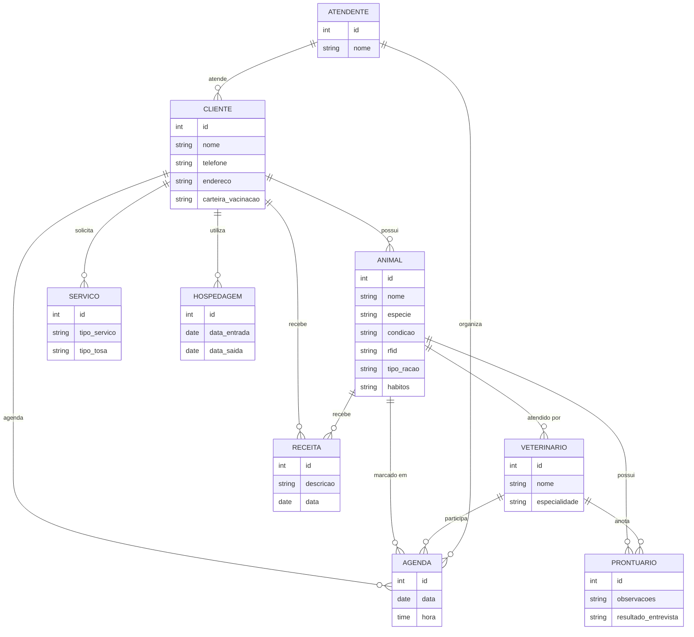
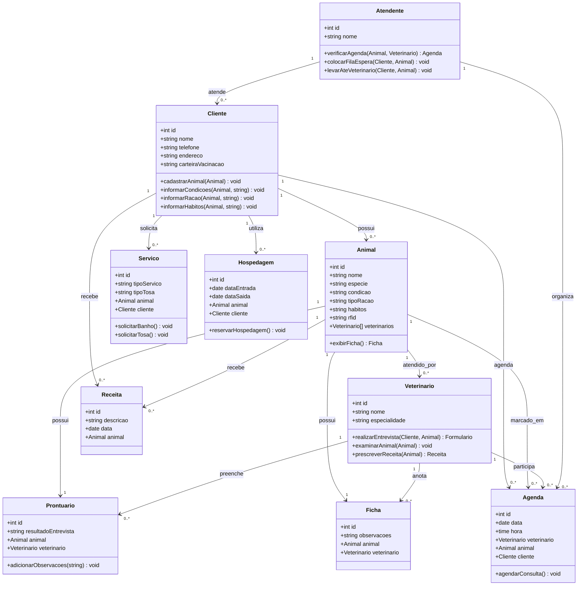

# otavio_maniezzo
Repositório da disciplina de engenharia de software.

- [otavio\_maniezzo](#otavio_maniezzo)
- [1. Introdução](#1-introdução)
- [2. Descrição do sistema.](#2-descrição-do-sistema)
- [3. Visão geral do sistema.](#3-visão-geral-do-sistema)
- [4. Diagrama ER](#4-diagrama-er)
- [5. Diagrama de classe.](#5-diagrama-de-classe)
- [6. Casos de uso.](#6-casos-de-uso)
  - [6.1 Histórias de usario.](#61-histórias-de-usario)
- [7. Diagrama de componentes.](#7-diagrama-de-componentes)
- [8. Diagrama de implantação.](#8-diagrama-de-implantação)
- [9. Protótipo de telas.](#9-protótipo-de-telas)
- [10. Diagrama de navegçaõ de telas.](#10-diagrama-de-navegçaõ-de-telas)
- [11. Pilha tecnológica.](#11-pilha-tecnológica)
- [12. Requisitos de sistema.](#12-requisitos-de-sistema)
- [13. Considerações de segurança.](#13-considerações-de-segurança)
- [14. Manutenção e instalação.](#14-manutenção-e-instalação)
- [15. Glossário](#15-glossário)
- [16. Script SQL](#16-script-sql)
  - [16.1. Comandos create table;](#161-comandos-create-table)
  - [16.2. Comandos insert gerando dados ficticios;](#162-comandos-insert-gerando-dados-ficticios)


# 1. Introdução

O projeto a seguir apresenta um sistema desenvolvido para uma petshop. A empresa é considerada micro e inciou as atividades recentemente. Ao possuir serviços exclusivos, os sistemas presentes no mercado não se enquadra, desta forma, os proprietários decidiram desenvolver uma solução própria. Esta solução é detalhada a seguir.

# 2. Descrição do sistema.

Descrição do cenário onde o sistema deverá funcionar.

1. Uma clínica veterinária atende apenas os animais: gatos e cachorros
   
2. Os clientes devem fazer um cadastro de si e dos animais.
   
3. Os clientes devem informar as condições nas quais os animais chegam.
   
4. Os clientes devem informar o tipo de ração que o animal come.
   
5. O cliente deve informar hábitos do animal
   
6. Para cada animal é possível que mais de um veterinário o atenda.
   
7. Os animais podem chegar e serem atendidos de acordo com uma agenda do dia.
   
8. Cada animal atendido receberá uma ficha e um prontuário
   
9.  Outros dono podem querer marcar horários de atendimento futuro
    
10. O atendimento gera uma receita para o animal.
    
11. Quando um cliente chega na clínica veterinária ele é atendido por um atendente.
    
12. O atendente deve verificar se existe agenda disponível com um veterinário.
    
13. O atendente deve colocar o cliente e seu animal na fila de espera, se for o caso.
    
14. O atendente deve levar o cliente e o animal até o veterinário. 
    
15. O veterinário deve realizar uma entrevista com o dono do animal.
    
16. O resultado da entrevista deve ir para um formulário.
    
17. O veterinário deverá examinar o animal e anotar em prontuário(ficha) suas observações.
    
18. Dependendo da situação do animal este receberá uma receita.
    
19. Marcar os animais com RFID.
    
20. O clientes devem informar dados da carteira de vacinação 
    
21. A clinica busca e entrega animais para banho e tosa
    
22. O tipo de tosa deve ser previamente informado 
    
23. Oferece hospedagem para os animais 
    

   


# 3. Visão geral do sistema.

Descrição do sistema e suas relações.

# 4. Diagrama ER



# 5. Diagrama de classe.



# 6. Casos de uso.

## 6.1 Casos de uso


## 6.2 Histórias de usuario.

# Histórias de Usuário

## Cadastro de Cliente e Animal
**Como** cliente da clínica veterinária,  
**Quero** cadastrar meus dados pessoais e os dados dos meus animais,  
**Para** que eu possa utilizar os serviços da clínica.

## Informar Condições do Animal
**Como** cliente da clínica veterinária,  
**Quero** informar as condições em que o meu animal chegou à clínica,  
**Para** que o veterinário possa entender o estado atual do animal.

## Informar Tipo de Ração
**Como** cliente da clínica veterinária,  
**Quero** informar o tipo de ração que o meu animal consome,  
**Para** que essa informação esteja registrada no prontuário do animal.

## Informar Hábitos do Animal
**Como** cliente da clínica veterinária,  
**Quero** informar os hábitos do meu animal,  
**Para** que o veterinário tenha um histórico comportamental do animal.

## Atendimento por Vários Veterinários
**Como** administrador da clínica,  
**Quero** que mais de um veterinário possa atender o mesmo animal,  
**Para** garantir a flexibilidade e a disponibilidade no atendimento.

## Atendimento com Agenda do Dia
**Como** cliente da clínica veterinária,  
**Quero** que o meu animal seja atendido conforme a agenda disponível do dia,  
**Para** que o atendimento seja organizado e eficiente.

## Ficha e Prontuário
**Como** veterinário,  
**Quero** registrar as informações do atendimento de cada animal em uma ficha e prontuário,  
**Para** manter um histórico médico completo do animal.

## Marcar Atendimento Futuro
**Como** cliente da clínica veterinária,  
**Quero** poder marcar horários de atendimento futuro para o meu animal,  
**Para** garantir que o atendimento ocorra em um momento conveniente.

## Gerar Receita
**Como** veterinário,  
**Quero** gerar uma receita após o atendimento do animal,  
**Para** prescrever medicamentos ou tratamentos adequados.

## Atendimento Inicial pelo Atendente
**Como** atendente da clínica veterinária,  
**Quero** receber o cliente e seu animal ao chegarem na clínica,  
**Para** garantir que o processo de atendimento seja iniciado corretamente.

## Verificar Agenda com Veterinário
**Como** atendente da clínica veterinária,  
**Quero** verificar a agenda disponível dos veterinários,  
**Para** saber se há disponibilidade para o atendimento imediato ou futuro.

## Fila de Espera
**Como** atendente da clínica veterinária,  
**Quero** colocar o cliente e seu animal em uma fila de espera, caso necessário,  
**Para** organizar o fluxo de atendimentos.

## Levar Cliente até o Veterinário
**Como** atendente da clínica veterinária,  
**Quero** levar o cliente e seu animal até o veterinário,  
**Para** garantir que o atendimento ocorra sem problemas.

## Entrevista Inicial com o Dono do Animal
**Como** veterinário,  
**Quero** realizar uma entrevista com o dono do animal,  
**Para** entender o histórico e as condições do animal antes de iniciar o exame.

## Formulário de Entrevista
**Como** veterinário,  
**Quero** registrar os resultados da entrevista em um formulário,  
**Para** que essas informações fiquem documentadas no prontuário do animal.

## Exame e Prontuário
**Como** veterinário,  
**Quero** examinar o animal e anotar minhas observações no prontuário,  
**Para** manter um registro médico preciso.

## Receita para Tratamento
**Como** veterinário,  
**Quero** emitir uma receita para o tratamento do animal, se necessário,  
**Para** que o animal receba o cuidado adequado.

## Marcar Animal com RFID
**Como** administrador da clínica veterinária,  
**Quero** marcar os animais com RFID,  
**Para** facilitar a identificação e o acompanhamento do animal.

## Informar Carteira de Vacinação
**Como** cliente da clínica veterinária,  
**Quero** informar os dados da carteira de vacinação do meu animal,  
**Para** que o veterinário tenha acesso ao histórico vacinal.

## Serviço de Banho e Tosa
**Como** cliente da clínica veterinária,  
**Quero** solicitar o serviço de busca e entrega do meu animal para banho e tosa,  
**Para** que meu animal receba esses cuidados sem que eu precise levá-lo à clínica.

## Informar Tipo de Tosa
**Como** cliente da clínica veterinária,  
**Quero** informar o tipo de tosa desejada para meu animal,  
**Para** que o serviço de tosa atenda às minhas preferências.

## Serviço de Hospedagem
**Como** cliente da clínica veterinária,  
**Quero** solicitar o serviço de hospedagem para o meu animal,  
**Para** que ele seja cuidado enquanto eu estiver ausente.


# 7. Diagrama de componentes.

# 8. Diagrama de implantação.

# 9. Protótipo de telas.

# 10. Diagrama de navegçaõ de telas.

# 11. Pilha tecnológica.

# 12. Requisitos de sistema.

# 13. Considerações de segurança.

# 14. Manutenção e instalação.

# 15. Glossário

# 16. Script SQL

## 16.1. Comandos create table;

```SQL
-- Tabela de clientes
CREATE TABLE IF NOT EXISTS Cliente (
    id INT AUTO_INCREMENT PRIMARY KEY,
    nome VARCHAR(100) NOT NULL,
    telefone VARCHAR(20) NOT NULL,
    endereco VARCHAR(255),
    carteira_vacinacao VARCHAR(255)
);

-- Tabela de animais
CREATE TABLE IF NOT EXISTS Animal (
    id INT AUTO_INCREMENT PRIMARY KEY,
    nome VARCHAR(100) NOT NULL,
    especie ENUM('gato', 'cachorro') NOT NULL,  -- Regra 1
    condicao VARCHAR(255) NOT NULL,  -- Condições dos animais
    tipo_racao VARCHAR(255) NOT NULL,  -- Tipo de ração
    habitos TEXT,  -- Hábitos do animal
    rfid VARCHAR(50) UNIQUE,  -- Marcar os animais com RFID
    cliente_id INT,
    FOREIGN KEY (cliente_id) REFERENCES Cliente(id) ON DELETE CASCADE
);

-- Tabela de veterinários
CREATE TABLE IF NOT EXISTS Veterinario (
    id INT AUTO_INCREMENT PRIMARY KEY,
    nome VARCHAR(100) NOT NULL,
    especialidade VARCHAR(100)
);

-- Tabela de atendentes
CREATE TABLE IF NOT EXISTS Atendente (
    id INT AUTO_INCREMENT PRIMARY KEY,
    nome VARCHAR(100) NOT NULL
);

-- Tabela de agenda
CREATE TABLE IF NOT EXISTS Agenda (
    id INT AUTO_INCREMENT PRIMARY KEY,
    data DATE NOT NULL,
    hora TIME NOT NULL,
    veterinario_id INT,
    animal_id INT,
    cliente_id INT,
    atendente_id INT,
    FOREIGN KEY (veterinario_id) REFERENCES Veterinario(id) ON DELETE SET NULL,
    FOREIGN KEY (animal_id) REFERENCES Animal(id) ON DELETE CASCADE,
    FOREIGN KEY (cliente_id) REFERENCES Cliente(id) ON DELETE CASCADE,
    FOREIGN KEY (atendente_id) REFERENCES Atendente(id) ON DELETE SET NULL
);

-- Tabela de prontuários
CREATE TABLE IF NOT EXISTS Prontuario (
    id INT AUTO_INCREMENT PRIMARY KEY,
    observacoes TEXT NOT NULL,
    resultado_entrevista TEXT,
    animal_id INT,
    veterinario_id INT,
    FOREIGN KEY (animal_id) REFERENCES Animal(id) ON DELETE CASCADE,
    FOREIGN KEY (veterinario_id) REFERENCES Veterinario(id) ON DELETE SET NULL
);

-- Tabela de receitas
CREATE TABLE IF NOT EXISTS Receita (
    id INT AUTO_INCREMENT PRIMARY KEY,
    descricao TEXT NOT NULL,
    data DATE NOT NULL,
    animal_id INT,
    FOREIGN KEY (animal_id) REFERENCES Animal(id) ON DELETE CASCADE
);

-- Tabela de serviços (banho, tosa, etc.)
CREATE TABLE IF NOT EXISTS Servico (
    id INT AUTO_INCREMENT PRIMARY KEY,
    tipo_servico VARCHAR(100) NOT NULL,
    tipo_tosa VARCHAR(100),  -- Tipo de tosa, caso aplicável
    animal_id INT,
    cliente_id INT,
    FOREIGN KEY (animal_id) REFERENCES Animal(id) ON DELETE CASCADE,
    FOREIGN KEY (cliente_id) REFERENCES Cliente(id) ON DELETE CASCADE
);

-- Tabela de hospedagem
CREATE TABLE IF NOT EXISTS Hospedagem (
    id INT AUTO_INCREMENT PRIMARY KEY,
    data_entrada DATE NOT NULL,
    data_saida DATE NOT NULL,
    animal_id INT,
    cliente_id INT,
    FOREIGN KEY (animal_id) REFERENCES Animal(id) ON DELETE CASCADE,
    FOREIGN KEY (cliente_id) REFERENCES Cliente(id) ON DELETE CASCADE
);

-- Tabela de relação entre veterinário e animal (muitos para muitos)
CREATE TABLE IF NOT EXISTS Veterinario_Atende_Animal (
    veterinario_id INT,
    animal_id INT,
    PRIMARY KEY (veterinario_id, animal_id),
    FOREIGN KEY (veterinario_id) REFERENCES Veterinario(id) ON DELETE CASCADE,
    FOREIGN KEY (animal_id) REFERENCES Animal(id) ON DELETE CASCADE
);

-- Tabela de relação entre clientes e animais (um cliente pode ter vários animais)
CREATE TABLE IF NOT EXISTS Cliente_Tem_Animal (
    cliente_id INT,
    animal_id INT,
    PRIMARY KEY (cliente_id, animal_id),
    FOREIGN KEY (cliente_id) REFERENCES Cliente(id) ON DELETE CASCADE,
    FOREIGN KEY (animal_id) REFERENCES Animal(id) ON DELETE CASCADE
);

```

## 16.2. Comandos insert gerando dados ficticios;

```SQL
-- Inserindo dados na tabela Cliente
INSERT INTO Cliente (nome, telefone, endereco, carteira_vacinacao)
VALUES
('Maria Silva', '11987654321', 'Rua das Flores, 123', '123456'),
('João Pereira', '11987651234', 'Av. Paulista, 1000', '654321'),
('Ana Souza', '11987659876', 'Rua do Sol, 456', '987654');

-- Inserindo dados na tabela Animal
INSERT INTO Animal (nome, especie, condicao, tipo_racao, habitos, rfid, cliente_id)
VALUES
('Rex', 'cachorro', 'Com tosse', 'Ração Premium', 'Corre muito, dorme pouco', 'RFID123', 1),
('Mia', 'gato', 'Apatia', 'Ração Light', 'Gosta de subir em móveis', 'RFID456', 2),
('Bobby', 'cachorro', 'Saudável', 'Ração Normal', 'Brincalhão, late bastante', 'RFID789', 3);

-- Inserindo dados na tabela Veterinario
INSERT INTO Veterinario (nome, especialidade)
VALUES
('Dr. Pedro Costa', 'Clínico Geral'),
('Dra. Fernanda Lima', 'Cirurgiã'),
('Dr. Carlos Souza', 'Dermatologista');

-- Inserindo dados na tabela Atendente
INSERT INTO Atendente (nome)
VALUES
('Paula Martins'),
('Carlos Silva'),
('Mariana Gonçalves');

-- Inserindo dados na tabela Agenda
INSERT INTO Agenda (data, hora, veterinario_id, animal_id, cliente_id, atendente_id)
VALUES
('2024-09-18', '10:00:00', 1, 1, 1, 1),
('2024-09-19', '14:00:00', 2, 2, 2, 2),
('2024-09-20', '09:30:00', 3, 3, 3, 3);

-- Inserindo dados na tabela Prontuario
INSERT INTO Prontuario (observacoes, resultado_entrevista, animal_id, veterinario_id)
VALUES
('Animal com tosse seca. Suspeita de gripe canina.', 'Dono relatou que o cachorro está tossindo há 3 dias.', 1, 1),
('Gato apresenta apatia e falta de apetite. Exames solicitados.', 'Dona relatou que o gato está apático e não come.', 2, 2),
('Cachorro saudável, sem sinais de doença.', 'Dono relatou que o cachorro está bem.', 3, 3);

-- Inserindo dados na tabela Receita
INSERT INTO Receita (descricao, data, animal_id)
VALUES
('Antibiótico para gripe canina - 10 dias', '2024-09-18', 1),
('Suplemento alimentar para apatia - 7 dias', '2024-09-19', 2),
('Vermífugo anual', '2024-09-20', 3);

-- Inserindo dados na tabela Servico (Banho e Tosa)
INSERT INTO Servico (tipo_servico, tipo_tosa, animal_id, cliente_id)
VALUES
('Banho', 'Curta', 1, 1),
('Tosa', 'Longa', 2, 2),
('Banho e Tosa', 'Curta', 3, 3);

-- Inserindo dados na tabela Hospedagem
INSERT INTO Hospedagem (data_entrada, data_saida, animal_id, cliente_id)
VALUES
('2024-09-15', '2024-09-17', 1, 1),
('2024-09-10', '2024-09-12', 2, 2),
('2024-09-01', '2024-09-03', 3, 3);

-- Inserindo dados na tabela Veterinario_Atende_Animal (Relação muitos para muitos)
INSERT INTO Veterinario_Atende_Animal (veterinario_id, animal_id)
VALUES
(1, 1), -- Dr. Pedro atendeu Rex
(2, 2), -- Dra. Fernanda atendeu Mia
(3, 3); -- Dr. Carlos atendeu Bobby

```

